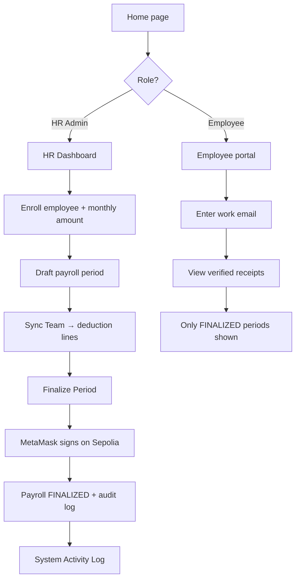

# Presentation Workbook: Workplace Zakat Platform

This workbook is your script and guide for presenting your project. It is structured chronologically, matching how you should explain the platform to your evaluator.

---

## 1. The Hook (Introduction & Purpose)

**Goal:** Instantly communicate *what* this is and *why* it matters.

- **"Hello everyone. Today I am presenting the Workplace Zakat Platform."**
- **The Problem:** Currently, there is a disconnect between modern corporate payroll systems and Islamic financial obligations. Muslims who want to pay Zakat often have to calculate and deduct it manually. When companies *do* try to automate charitable giving, employees have to blindly trust that the HR department did the math correctly and actually allocated the funds. There is a "Trust Deficit."
- **The Solution:** This project bridges Web2 HR systems with Web3 cryptographic verification. It is a corporate HR portal where administrators can run monthly Zakat deductions via payroll. But crucially, every finalized payroll is cryptographically hashed and permanently anchored to the Sepolia Ethereum blockchain.
- **The Benefit:** It provides 100% transparency. Employees get a beautiful Web2 receipt, but under the hood, they have absolute cryptographic proof that their deductions are authentic and untampered with.

---

## 2. The Tech Stack (What we used to build it)

**Goal:** Show your technical competence and explain your architectural choices.

- **Frontend:** Next.js (App Router), React, and Tailwind CSS. We explicitly used a "Premium Utilitarian Minimalism" design system to make it look like top-tier enterprise software (like Stripe or Rippling).
- **Backend & Database:** Next.js Server Actions connecting to a PostgreSQL database via Prisma ORM. We keep heavy, private data (like names and emails) here.
- **Web3 Integration:** We used the `viem` library to connect the Next.js frontend to MetaMask.
- **Smart Contract:** Written in Solidity and deployed to the Sepolia Testnet.

---

## 3. The Architecture (Balancing On-Chain & Off-Chain)

**Goal:** Address the specific grading rubric requirement about "Data Architecture."

- **"A core focus of this project was intentional Data Architecture. We asked ourselves: What actually belongs on the blockchain?"**
- **Off-Chain (PostgreSQL):** We *do not* put employee names, emails, or exact salary numbers on the public blockchain. Doing so would violate corporate privacy and cost an exorbitant amount in gas fees.
- **On-Chain (Sepolia):** We only put the **Cryptographic Hash** of the payroll event on the blockchain. 
- **How it works:** When HR finalizes a payroll, the frontend creates a JSON payload (e.g., "Payroll Run May 2026 Finalized"). It hashes that payload and sends *only the hash* to the smart contract. This provides mathematical proof that the event happened exactly as stated, without leaking any private data.

---

## 4. The Smart Contract (Explaining `ZakatAuditLog.sol`)

**Goal:** Explain the logic of your Solidity code clearly.

- **"Let's look at the smart contract that powers this trust: `ZakatAuditLog.sol`."**
- **Append-Only Ledger:** The contract acts like an immutable audit log. It maintains an array of `AuditBlock` structs.
- **Hash-Linking:** Just like a real blockchain, every block we add to our contract must reference the hash of the *previous* block (`prevHash`). If an attacker tries to alter a payroll record from three months ago, the hashes won't match, and the chain breaks.
- **Security (`onlyRegistrar`):** Not just anyone can add a block. We use a modifier called `onlyRegistrar`. When I deployed the contract, my HR wallet was set as the registrar. Only my specific wallet can successfully call the `append()` function.
- **Execution:** Inside the `append()` function, the contract takes the `prevHash` and the new `payload`, runs them through `keccak256` (Ethereum's hashing algorithm), stores the new `blockHash`, and emits an event.
- **Other Functions:** The contract also includes `blockCount()` and `getBlock()` for public transparency (anyone can read the chain), and `transferRegistrar()` just in case the HR department needs to rotate or change their official MetaMask wallet.

---

## 5. Optimization Techniques (Smart Contract Efficiency)

**Goal:** Show that you understand how to write efficient, production-ready Solidity code.

- **"Because storing data on the Ethereum Virtual Machine (EVM) is expensive, we implemented several gas optimization techniques."**
- **Data Minimization:** Instead of storing massive arrays of employee names and deduction amounts on the blockchain, we only store a tiny JSON payload containing the **Event Type** and **Payroll ID**. The heavy data stays in our Postgres database.
- **Fixed-Size Types:** We strictly use highly efficient data types like `bytes32` for all cryptographic hashes and `uint64` for the block index, optimizing EVM storage slot usage.
- **Native Hashing:** We utilize Ethereum's native `keccak256` hashing algorithm natively within the contract to calculate block hashes, ensuring maximum speed on the network.
- **Off-chain Aggregation:** By aggregating all employees into a single "Payroll Finalized" event, the HR admin only pays **one gas fee per month** for the entire company, rather than a separate fee for each individual employee.

---

## 6. Application Process (End-to-end flow)

**Goal:** Show evaluators *how* someone actually uses the platform — from first visit to verified receipt.

- **"Before the live demo, let me walk you through the process in order. There are two roles: HR Admin and Employee."**

### HR Admin flow

| Step | Where | Action | What happens |
|------|--------|--------|----------------|
| 1 | Home (`/`) | Click **Access HR Console** | Opens the HR Dashboard |
| 2 | HR Dashboard | **New Enrollment** — pick employee, set monthly amount (e.g. $25), **Save Enrollment** | Active deduction plan is stored in PostgreSQL; an audit block is appended to the local hash chain |
| 3 | HR Dashboard | **Payroll Periods** — enter a label (e.g. "May 2026"), **Draft New Period** | A `DRAFT` payroll run is created and logged |
| 4 | Same period card | Click **Sync Team** | Deduction lines are generated for every *active* enrollment; totals appear on the card |
| 5 | Same period card | Click **Finalize Period** | MetaMask prompts on Sepolia → HR wallet calls `append()` on `ZakatAuditLog.sol` → on success, the period becomes `FINALIZED` and a new audit block is written |
| 6 | HR Dashboard (bottom) | Review **System Activity Log** | Hash-linked signatures prove each step (enrollment, draft, sync, finalize) |

### Employee flow

| Step | Where | Action | What happens |
|------|--------|--------|----------------|
| 1 | Home (`/`) or direct link | **View Sample Receipt** or open `/employee` | Employee portal loads — no wallet required |
| 2 | Employee portal | Enter work email (e.g. `sara.elamrani@demo.local`), **View Records** | Server returns only deductions from **finalized** payroll periods |
| 3 | Receipt card | Read period labels, amounts, and verification dates | Employee sees a clean Web2 receipt backed by HR’s on-chain finalize step |

### Process diagram (for slides or docs)

- **Key line for evaluators:** *"HR does the work in Web2 until the one Web3 moment — finalize. Employees never touch MetaMask; they only consume the verified outcome."*

---

## 7. The Live Demo (Walking through the app)

**Goal:** Show them the app working in real-time.

1. **Show the HR Dashboard:** Point out the minimalist UI. Explain that HR can enroll an employee in a deduction (e.g., $25/month).
2. **Draft a Payroll:** Create a new payroll period (e.g., "May 2026") and click "Sync Team" to automatically calculate the deductions.
3. **The Web3 Moment:** Click **"Finalize Period"**.
  - *Say:* "This is where Web2 meets Web3. To finalize this data, the HR Admin must cryptographically sign it."
  - Show the MetaMask popup. Point out that we are on the Sepolia network. Confirm the transaction.
4. **Show the Activity Log:** Once confirmed, point to the "System Activity Log" at the bottom of the HR page to show the newly generated signature.
5. **Show the Employee View:** Switch to the Employee Receipt page. Enter `sara.elamrani@demo.local`.
  - *Say:* "Notice that Sara doesn't need MetaMask. She doesn't need to understand gas fees. She gets a clean, verified receipt proving her Zakat was securely logged on-chain by her employer."

---

## 8. Conclusion & Future Work

**Goal:** End strong and show you are thinking ahead.

- **"In conclusion, this project proves that enterprise systems can leverage blockchain for absolute transparency without sacrificing user experience or data privacy."**
- **Future Scope:** Currently, the system is an *auditing* platform. The logical next step for future development would be integrating a custom ERC-20 stablecoin (like `ZakatUSD`). In that future version, finalizing the payroll wouldn't just log a hash; it would automatically transfer the stablecoin tokens from the corporate treasury directly to a verified charity's wallet in the same transaction.
- **"Thank you. I am happy to answer any questions about the smart contract or the Next.js architecture."**

